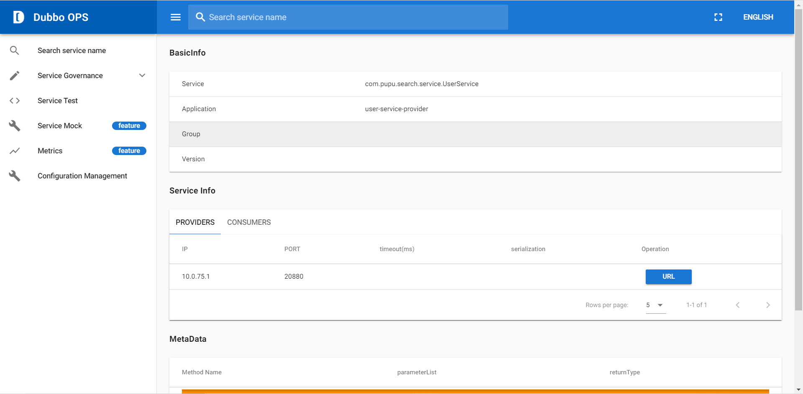
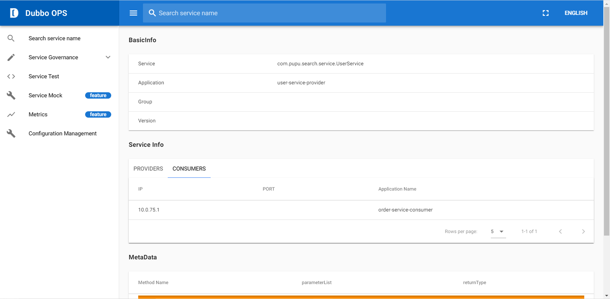

# Dubbo-demo

### 1. Dubbo-admin docker-compose.yml
```yml
version: '3'

services:
  zookeeper:
    image: zookeeper:3.4.13
    ports:
      - 2181:2181
  admin:
    image: apache/dubbo-admin
    depends_on:
      - zookeeper
    ports:
      - 8080:8080
    environment:
      - admin.registry.address=zookeeper://zookeeper:2181
      - admin.config-center=zookeeper://zookeeper:2181
      - admin.metadata-report.address=zookeeper://zookeeper:2181
```

### 2. Create dubbo-admin 
```bash
docker-compose up -d
```

### 3. Run user-service-provider application and order-service-consumer application

### 4. Dobbo-admin information
service provider

service consumer

